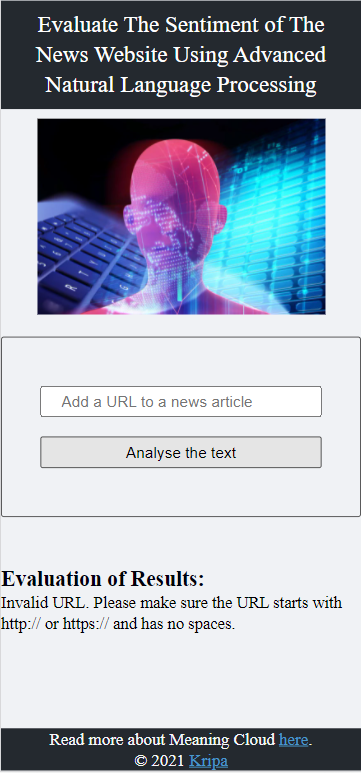

# Evaluate The Sentiment of The News Website Using Advanced Natural Language Processing

## Objective

This project is done to understand Webpack, Nodejs, Server-client workflow, Web APIs, Asynchronous code, Service worker, and Unit testing using Jest Framework. Using it, the web app is created that utilizes MeaningCloud API to get the sentiment values (sentiment, agreement, subjectivity, confidence and irony) of the news article using Natural Language Processing and dynamically update UI.

The goal of this project is to give you practice with:
- Setting up Webpack
- Sass styles
- Webpack Loaders and Plugins
- Creating layouts and page design
- Service workers
- Using APIs and creating requests to external urls

## Setup

Following steps are followed to run the project

* Setting up project environment and making sure Node, Express, Cors, Body parser, Webpack and all required packages are installed.

```bash
npm install
```
* Development and production environments are set up in webpack config files. The following commands are used to start the server and build bundled files

```bash
npm run build-dev
npm run build-prod
npm run start
```

## Use of app
To use the app, we need to enter the URL of the news article in the input box and need to submit the URL that would analyze the news article. It will provide us with the URL of the page with its sentiment analysis values (sentiment, agreement, subjectivity, confidence and irony). If the correct URL is not provided, it will throw an error message and we need to re-enter the correct URL.


## Technology used

HTML, CSS, NodeJS, Javascript (Vanilla), Express, Webpack, Sentiment Analysis


## Final Output
$~~~~~~~~~~~$
$~~~~~~~~~~~$
$~~~~~~~~~~~$
### WEB VERSION
$~~~~~~~~~~~$
$~~~~~~~~~~~$
$~~~~~~~~~~~$


$~~~~~~~~~~~$
$~~~~~~~~~~~$
$~~~~~~~~~~~$
### MOBILE VERSION
$~~~~~~~~~~~$
$~~~~~~~~~~~$
$~~~~~~~~~~~$
$~~~~~~~~~~~$


