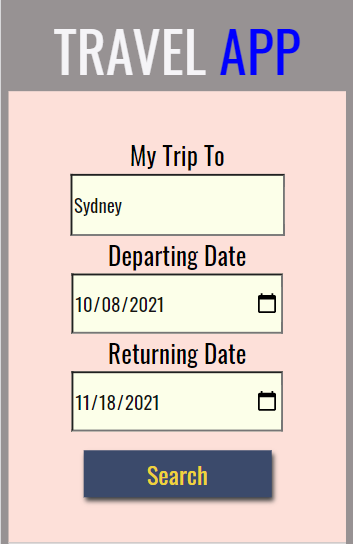
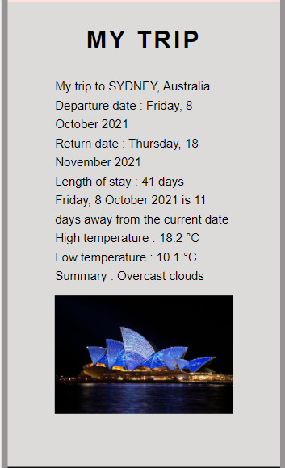
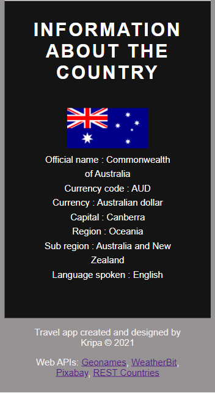

# TRAVEL APP

## Objective

This project is done to understand Webpack, Nodejs, Server-client workflow, Web APIs, Asynchronous code, Service worker, and Unit testing using Jest Framework. Using it, the web app is created that utilizes Geonames, Weatherbit, Pixabay and Restcountries API to get the current or forecasted weather values, image of the city and information about the countries.

The goal of this project is to give us practice with:
- Setting up Webpack
- Sass styles
- Webpack Loaders and Plugins
- Creating layouts and page design
- Service workers
- Using APIs and creating requests to external urls

## Setup

Following steps are followed to run the project

* Setting up project environment and making sure Node, Express, Cors, Body parser, Webpack and all required packages are installed.

```bash
npm install
```
* Development and production environments are set up in webpack config files. The following commands are used to start the server and build bundled files.

```bash
npm run build-dev
npm run build-prod
npm run start
```

## Use of app
To use the app, we need to enter the city, departure date and return date in the input box and need to submit. It will provide us with the weather information of the city around that time (forecasted high temperature and forecasted low temperature or current temperature, description of weather). It will also provide us with the information (countryName, image of the city, official name ,currency code and currency, capital, region, subregion,language and flag )of the country where the user is travelling.

## Technology used

HTML, CSS, NodeJS, Javascript (Vanilla), Express, Webpack


## User Interface (UI)








