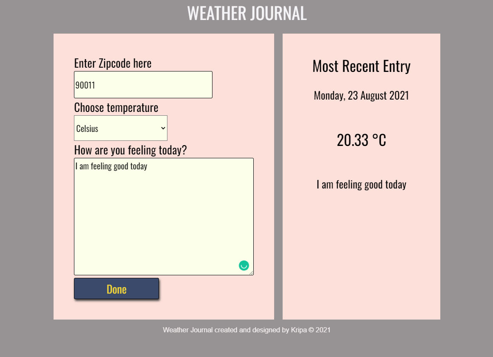

# Weather Journal App

## Objective

### This project is done to understand Web APIs and asynchronous code. Using it, web app  is created that utilizes OpenWeatherMap API to get weather data based on user's location (zipcode) and dynamically update UI.

## Setup

### Following steps are followed to run the project

* Node and packages (express, cors and body-parser) are installed that are used to create the server.
* After creating the server, 'node server.js' command is run in the terminal

## Development Strategy

* Setting up project environment and making sure Node and packages are installed and included in server.js file.
* POST and GET routes are added to ensure the correct retrieval of data from the server.
* API credentials are acquired from the OpenWeatherMap website.
* Async functions are created to fetch weather data.
* Updated UI dynamically by setting up a function for it.

## Technology used

#### HTML, CSS, Javascript (Vanilla)

## Final Output

